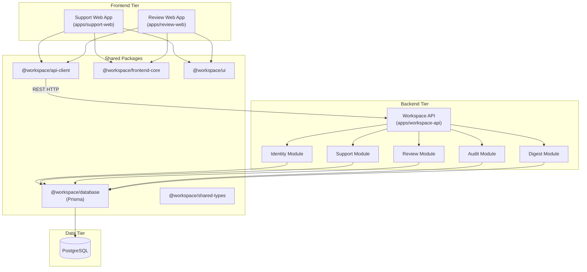
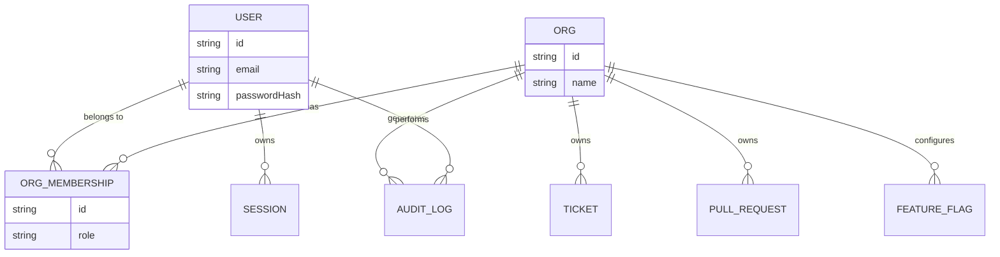

# System Architecture

## Architecture Overview

The Unified Workspace is a monolithic backend (Express/Node.js) driving multiple Single Page Applications (React/Vite) within a monorepo structure. It serves two distinct product dashboards: **Support Hub** and **Review Console**.

The system utilizes a shared packages strategy to maximize code reuse, ensuring that APIs, UI components, types, and core frontend logic are shared seamlessly across all client applications.

## Component Diagram

## Module Boundaries

- **Identity Service**: Handles user registration, login, session issuance, organization context, and organization switching.
- **Organization Service**: Organizations are managed intrinsically via the `Org` and `OrgMembership` database tables and accessed through the Identity module.
- **Dashboard 1 (Support Web)**: Dedicated React frontend for support agents. Focuses on Ticket management and Feature Flags.
- **Dashboard 2 (Review Web)**: Dedicated React frontend for code reviewers. Focuses on Pull Requests, Approvals, and Shared Resource visibility.
- **Resource Sharing**: Cross-organization resource visibility. An entity created in one organization can be explicitly shared with another, allowing targeted collaboration.
- **Audit**: An append-only logging system tracking critical events (e.g., ticket closed, PR approved). Protected at the database level to prevent tampering.
- **AI Digest**: An asynchronous cron job that summarizes daily activity for active users in their respective organizations, utilizing either a deterministic fallback or an LLM provider.

## Authentication & Authorization Flow

1. **Authentication**: Users log in using email/password. The backend issues a short-lived JSON Web Token (JWT) access token and a long-lived HTTP-only refresh cookie.
2. **Context Binding**: The access token uniquely binds a user's session to a specific `activeOrgId`.
3. **Authorization**: Roles (`ORG_ADMIN`, `SUPPORT_AGENT`, `REVIEWER`) are verified via Express middleware on protected routes. A user must be verified as a member of `activeOrgId` with the necessary privileges.

## Tenant Isolation Strategy

Tenant isolation is handled at the application layer via explicit `activeOrgId` injection:
1. Every authenticated request must pass through the `resolveActiveOrg` middleware.
2. This middleware extracts the `activeOrgId` from the JWT and queries the database to ensure the user still has an active `OrgMembership` for that specific organization.
3. Controllers implicitly use `req.user.activeOrgId` for all subsequent database queries (e.g., `where: { orgId: req.user.activeOrgId }`), preventing cross-tenant data leakage.

## Database Relationships

## Request Lifecycle

1. Browser initiates API call via `@workspace/api-client`.
2. Native fetch request is sent with `Authorization: Bearer <token>`.
3. Express server intercepts request.
4. `authenticate` middleware parses JWT.
5. `requireSession` middleware validates the active session in DB.
6. `resolveActiveOrg` middleware ensures user has access to `activeOrgId`.
7. Route controller executes business logic.
8. Prisma executes isolated SQL queries.
9. JSON payload is returned to the client.

## Security Considerations

- **Append-only Audit**: Audit logs are heavily protected against modification or deletion via database triggers.
- **Token Management**: Refresh tokens are stored in secure, `httpOnly` cookies, shielding them from XSS.
- **Strict Tenancy**: Missing `activeOrgId` context automatically halts requests via middleware.
